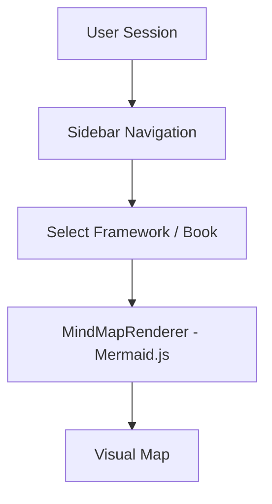

# 📚 Books Summaries — Cognitive Architecture Dashboard

A premium visual dashboard that maps cognitive and philosophical frameworks from influential books into interactive diagrams. Built with Next.js 16, Tailwind CSS v4, and Mermaid.js.



## ✨ Features

- **Interactive Visual Mapping** — Dynamic Mermaid.js diagrams for each cognitive framework
- **Rich Content** — Key insights, real-world examples, and statistics for every framework
- **Premium Aesthetics** — Dark mode, glassmorphic borders, custom typography, Framer Motion transitions
- **Static & Fast** — No backend, no database. All content is bundled at build time

## 🛠️ Tech Stack

| Layer | Technology |
|---|---|
| Framework | [Next.js 16](https://nextjs.org/) (App Router) |
| Language | [TypeScript](https://www.typescriptlang.org/) |
| Styling | [Tailwind CSS v4](https://tailwindcss.com/) |
| Visualizations | [Mermaid.js](https://mermaid.js.org/) |
| Animations | [Framer Motion](https://www.framer.com/motion/) |

## 🚀 Getting Started

```bash
# Install dependencies
npm install

# Start dev server
npm run dev
```

Open [http://localhost:3000](http://localhost:3000) to explore the dashboard.

## 📂 Project Structure

```
src/
├── app/              # Next.js App Router (pages & global styles)
├── components/       # Sidebar, MindMapRenderer, ProtocolTracker
└── data/             # Static framework content (frameworks.ts)
```

## 📖 Frameworks Covered

- **Sapolsky** — Determinism & biological drivers of behavior
- **Taleb** — Antifragility & the Barbell Strategy
- **Kahneman** — System 1 vs System 2 thinking
- **Csikszentmihalyi** — Flow state calibration
- **Newport** — Deep Work & attention management
- **Oakley** — Learning How to Learn (Focused vs Diffuse modes)
