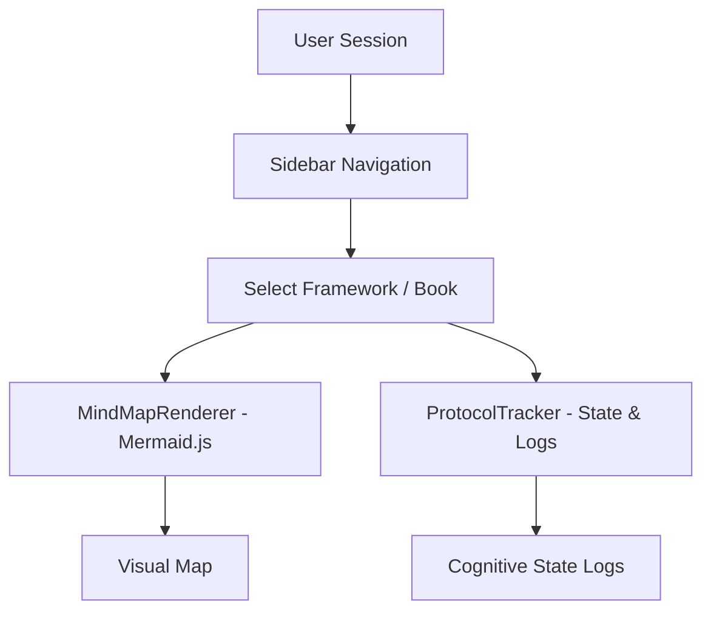

# 📚 Books Summaries (Cognitive Architecture Dashboard)

A high-performance visual dashboard built to operationalize complex scientific, cognitive, and philosophical frameworks. This project maps key concepts, books, and frameworks into interactive visual structures (such as mindmaps and protocol tracking logs) using an "Anti-AI-slop" premium design language.



## ✨ Features

- **Interactive Visual Mapping**: Dynamic rendering of cognitive frameworks and book summaries using Mermaid.js.
- **Protocol Tracker**: Interactive console to log cognitive state transitions, system analysis, and execution protocols.
- **Premium Aesthetics**: Clean dark mode with glassmorphic borders, custom typography, smooth transitions powered by Framer Motion, and layout hierarchy inspired by modern web guidelines.
- **Agentic Integration**: Philosophical approach to keep AI-generated code clean, modular, and visually professional.

## 🛠️ Tech Stack

- **Framework**: [Next.js 16 (App Router)](https://nextjs.org/)
- **Language**: [TypeScript](https://www.typescriptlang.org/)
- **Styling**: [Tailwind CSS v4](https://tailwindcss.com/)
- **Visualizations**: [Mermaid.js](https://mermaid.js.org/)
- **Animations**: [Framer Motion](https://www.framer.com/motion/)

## 🚀 Getting Started

### Prerequisites

Ensure you have Node.js (v18+) and npm/pnpm/yarn installed.

### Installation

1. Clone the repository:
   ```bash
   git clone https://github.com/dmitr/books-summaries.git
   cd books-summaries
   ```

2. Install dependencies:
   ```bash
   npm install
   ```

3. Run the development server:
   ```bash
   npm run dev
   ```

4. Open [http://localhost:3000](http://localhost:3000) in your browser to explore the dashboard.

## 📂 Project Structure

```text
books-summaries/
├── src/
│   ├── app/                # Next.js App Router (pages & styling)
│   ├── components/         # Reusable React components (Sidebar, MindMapRenderer, ProtocolTracker)
│   └── data/               # Source data models and frameworks (frameworks.ts)
├── public/                 # Static assets
├── tsconfig.json           # TypeScript configuration
└── tailwind.config.ts      # Tailwind styling configuration
```

## 📜 Agent Skills Integration

This project integrates design paradigms from **[AGENT_SKILLS.md](./AGENT_SKILLS.md)** (specifically the `Nutlope/hallmark` visual guidance) to deliver a highly polished interface that elevates both aesthetics and usability.
